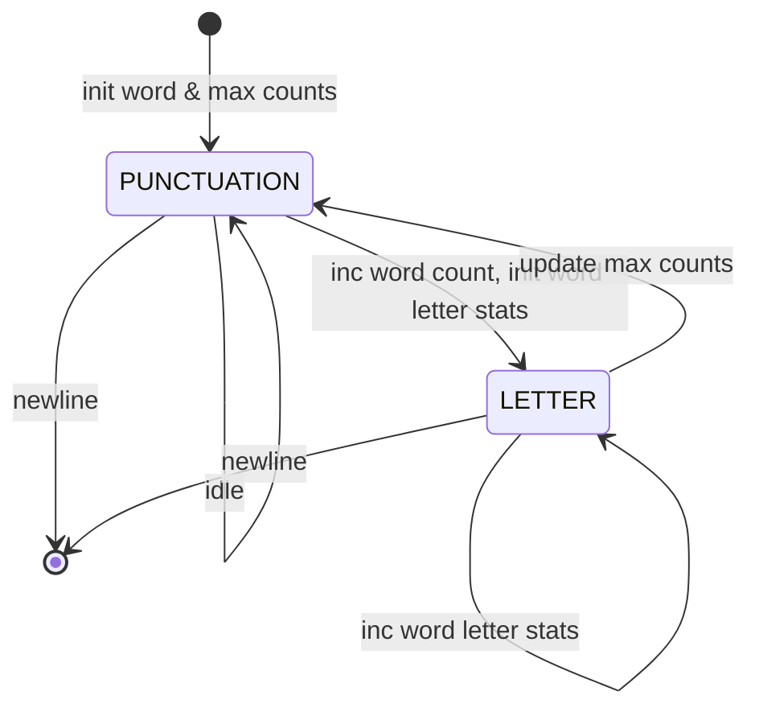

# Exercise 2.9: [Input Processing: Text Statistics]

## Problem Statement
Write a program that reads a line of text, counting the number of words,  
identifying the length of the longest word, the greatest number of vowels  
in a word, and/or any other statistics you can think of.

## Approach

The statistics we implement are:
1. Count the total number of words.
2. Count the longest word.
3. Count the greatest number of vowels.

My plan was based on studying text line processing implementation of the problem  
 **Decode a Message**, and implement a simplified state machine with modes  
  *Letter* and *punctuation*.  Here is an illustration.


  
To implement this, I defined the following subproblems.  
1. Given a line of text separated by whitespaces, count the number of words.
2. Count the longest word.
3. Count the greatest number of vowels.
4. Extend the solution so that a word is now  
separated by any punctuation or whitespace.

I decided not to add more statistics that the ones mentioned in the book,  
but I tried to make it easy to extend. That is the reason behind the effort  
of implementing the state machine. 

## Implementation Notes
- A *word* is a text sequence that is separated by whitespace or punctuation.
- The only punctuation symbols considered are defined in the page 42 of the book.


## Usage examples
```
Enter a line of text: How?many!words;are.Here?
The total number of words is: 5.
The greatest word has 5.
The greatest number of vowels in a word is: 2.

=================================================

Enter a line of text: The number of words of this sentence is nine.
The total number of words is: 9.
The greatest word has 8.
The greatest number of vowels in a word is: 3.

=================================================

Enter a line of text: Is the number of words of this sentence nine?
The total number of words is: 9.
The greatest word has 8.
The greatest number of vowels in a word is: 3.
```