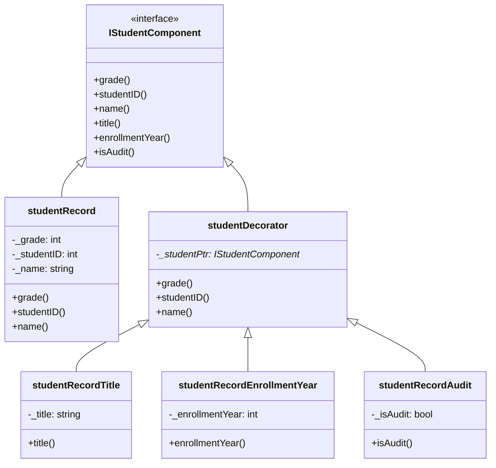

# Exercise 7.6

## Problem Statement

Suppose you are working on a project in which a particular studentRecord
may need to be augmented with one of the following pieces of data: term
paper title, year of enrollment, or a bool indicating whether the student is
auditing the class. You don’t want to include all of these data fields in the
base studentRecord class, knowing that in most cases they won’t be used. Your
first thought is to create three subclasses, each having one of the data
fields, with names such as `studentRecordTitle`, `studentRecordYear` and
studentRecordAudit. Then you are informed that some student records will
contain two of these additional data fields or perhaps all three. Creating
subclasses for each possible variation is impractical. Find a design pattern
that addresses this conundrum, and implement a solution.

## Design overview

The design pattern that I used to solve this problem is *decorator*. Here is
the definition I took from Head First Design Patterns (pg 93):

*The decorator pattern attaches additional responsibilities to an object
dynamically that provides an alternative to subclassing for extending
functionality*

The main benefit that we will get with the decorator is the ability of adding
attributes in runtime and with flexibility. We can "decorate" one student
with one, two, or with every attribute. Each new attribute is handled by a new
decorator, so we can extend the design without modification, following the
open-closed principle.

## Core Components

### Base Interface (IStudentComponent)

The foundation of the decorator pattern is established through the
`IStudentComponent` interface, which declares the attributes of the student.

### Concrete Component (studentRecord)

`studentRecord` serves as the base concrete implementation with core student
data: the id, the grade and the name.

### Abstract Decorator (studentDecorator)

`studentDecorator` acts as the base decorator class:

Maintains a reference to an `IStudentComponent` object. By default, it
delegates the behaviour to the decorated component. Each concrete decorator
will override this default behaviour to make it concrete.

## UML Diagram

