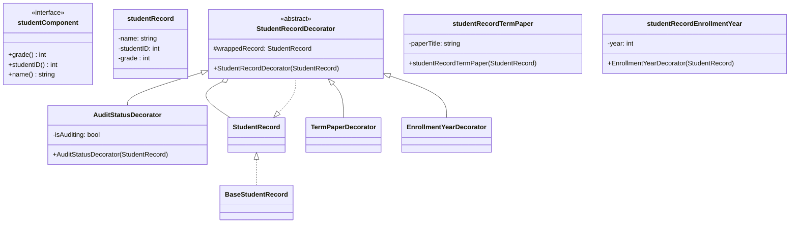

# Exercise 7.6

## Problem Statement

Suppose you are working on a project in which a particular studentRecord
may need to be augmented with one of the following pieces of data: term
paper title, year of enrollment, or a bool indicating whether the student is
auditing the class. You don’t want to include all of these data fields in the
base studentRecord class, knowing that in most cases they won’t be used. Your
first thought is to create three subclasses, each having one of the data fields,
with names such as studentRecordTitle, studentRecordYear and studentRecordAudit.
Then you are informed that some student records will contain two of these
additional data fields or perhaps all three. Creating subclasses for each
possible variation is impractical. Find a design pattern that addresses this
conundrum, and implement a solution.

<!-- 
## Analysis

The design pattern that addresses this problem is *decorator*. Here is the
definition I took from Head First Design Patterns (pg 93):

*The decorator pattern attaches additional responsibilities to an object
dynamically*



## Test Case

To illustrate the benefit of this pattern, I have augmented the collection of
students by including the new data. To encapuslate this extension I will
overload the signature of the method `addRecord` so that the client can
add the optional data.

```cpp
void addRecord(int stuNum, int grade, string name);
void addRecord(int stuNum, int grade, string name, string title);
void addRecord(int stuNum, int grade, string name, int enrollYear)
void addRecord(int stuNum, int grade, string name, bool isAudit);
```
-->
