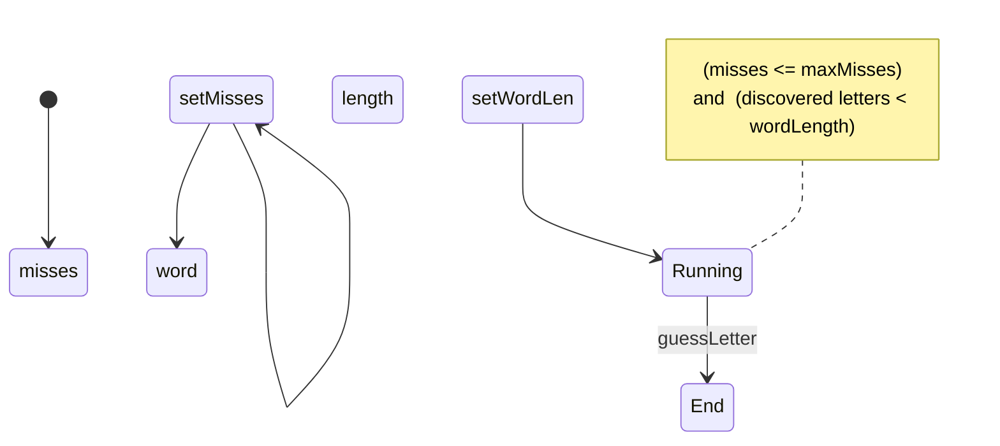

# Exercise 8.1: Improved Hangman

## Problem Statement

Write a program that will be Player 1 in a text-based version of hangman (that
is, you don’t actually have to draw a hanged man—just keep track of the number
of incorrect guesses). Player 2 will set the difficulty of the game by
specifying the length of the word to guess as well as the number of incorrect
guesses that will lose the game. The twist is that the program will cheat.
Rather than actually picking a word at the beginning of the game, the program
may avoid picking a word, so long as when Player 2 loses, the program can
display a word that matches all the information given to Player 2. The
correctly guessed letters must appear in their correct positions, and none of
the incorrectly guessed letters can appear in the word at all. When the game
ends, Player 1 (the program) will tell Player 2 the word that was chosen.
Therefore, Player 2 can never prove that the game is cheating; it’s just that
the likelihood of Player 2 winning is small.

Write a complete implementation for the cheating hangman problem that’s
better than mine.

## Design Improvements

- Make the word list a class.
- Minor changes to adapt to modern C++
- Implement the class HangmanGame
- Simplify the main method as much as possible.
- Pattern matching has been simplified.

## New Functionality

### 8.1.1 Allow the user to set the difficulty of the game

- The user can specify the size of the puzzle within a limited range. The
range will be defined by the program based on the list of words. The program
will validate the user input and ask again if such input is out of range.

- I implement state tracking to ensure that the difficulty is set before
the game starts.

### 8.1.2 Display the number of misses available

- The method `availableMisses()` has been added.
- This value is displayed to the player at the beginning of each turn.

### 8.1.3 User interface decoupled from the game logic

A new class `hangmanUi` has been created to deal with the UI logic and
remove such logic from the game class and from the main function, and
to facilitate the future implementation of a graph user interface.

## To be implemented

- Check whether the guessed letter has been guessed before.
- Check that the input is in lower case.
- Offer the user to play again.

## Current Issues

- Remove the message 'File open Failed'.
- Improve game output format.